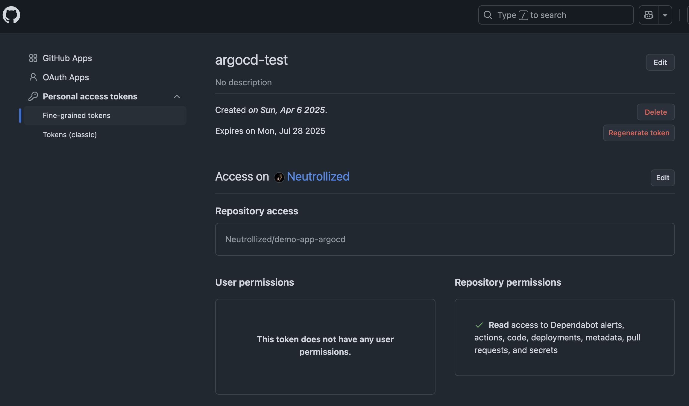
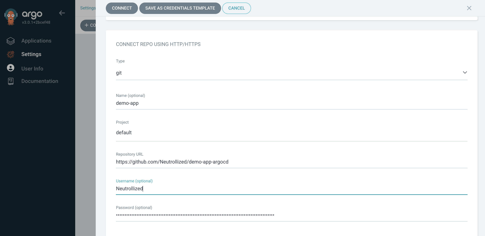
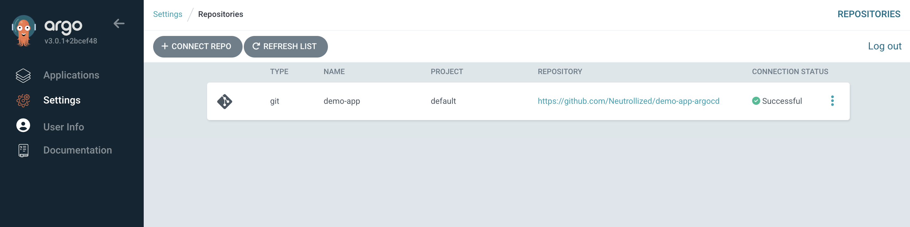
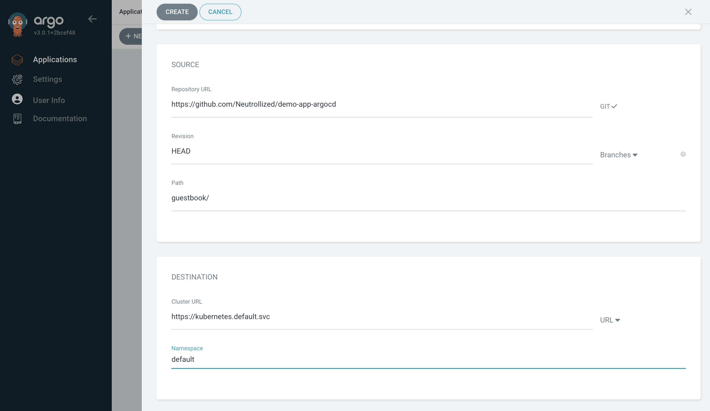
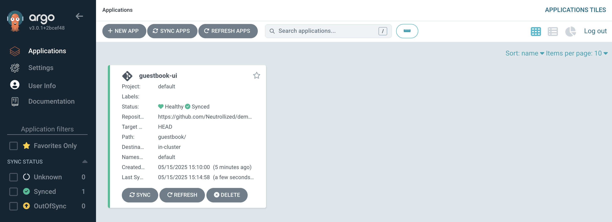

# Argo CD 
This is for the setup and usage for the new ArgoCD v3.x, which was released in May 2025! There has been some minor cosmetic changes with the UI from v2.x to v3.x, but most of the improvements are under-the-hood updates.

## Installation
The installation below is just a very basic, lightweight install with a load balancer (no certs).  For an ingress, more production-ready setup on GKE, check out these [example values](https://github.com/argoproj/argo-helm/tree/main/charts/argo-cd#gke-application-load-balancer).

### Helm
```
helm repo add argocd https://argoproj.github.io/argo-helm
helm repo updates

helm search repo argo-cd -l

helm install argocd \
  --create-namespace \
  -n argocd \
  --version 8.0.3 \
  -f myvalues.yaml \
  argocd/argo-cd
```

#### Uninstall
```
helm delete argocd -n argocd
```


### Regular Install
- [Getting Started](https://argo-cd.readthedocs.io/en/stable/getting_started/)
```
kubectl create namespace argocd
kubectl apply -n argocd -f https://raw.githubusercontent.com/argoproj/argo-cd/stable/manifests/install.yaml
```

- enable external load balancer
```
kubectl patch svc argocd-server -n argocd -p '{"spec": {"type": "LoadBalancer"}}'
```

- get admin password
```
kubectl -n argocd get secret argocd-initial-admin-secret -o jsonpath="{.data.password}" | base64 -d
```


## Example repo & apps
The example (private) repository that I created, *Neutrollized/demo-app-argocd* contains some examples from [argoproj/argocd-example-apps](https://github.com/argoproj/argocd-example-apps)

### Connecting to (private) GitHub repo




### Creating and syncing application




## ArgoCD Components
### Dex
- [Delegate authentication to EXternal identity providers](https://argocd-operator.readthedocs.io/en/latest/usage/dex/)

